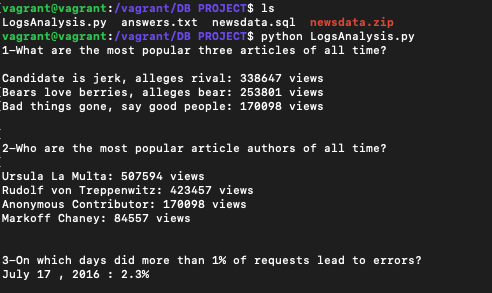

# Project: Logs Analysis
This is a Python Application to seek information through a PostgreSQL Database using psycopg2. Giving answer to these following questions:

What are the most popular three articles of all time? 
Who are the most popular article authors of all time? 
On which days did more than 1% of requests lead to errors?


# Run The Project

## Set Up First

1. Install [Vagrant](https://www.vagrantup.com)
2. Install [VrtualBox](https://www.virtualbox.org/)
3. Get [Vagrant Set Up](https://github.com/udacity/fullstack-nanodegree-vm)
4. Download and Unzip the database from [DB](https://d17h27t6h515a5.cloudfront.net/topher/2016/August/57b5f748_newsdata/newsdata.zip)
5. Take DataBase (DB) into vagrant folder.
6. Get Python code and expected answers from [Logs Analysis](https://github.com/Diegobg12/DB_Project.git)
7. Take the files into vagrant folder.
8. Run vagrant up to build the Virtual Machine
9. Run Vagrant ssh to connect
10. cd into the ```cd /vagrant/log_analysis```

## Erros running Vagrant?

Take a look in [Udacity's FAQ](https://classroom.udacity.com/nanodegrees/nd004/parts/8d3e23e1-9ab6-47eb-b4f3-d5dc7ef27bf0/modules/bc51d967-cb21-46f4-90ea-caf73439dc59/lessons/262a84d7-86dc-487d-98f9-648aa7ca5a0f/concepts/a9cf98c8-0325-4c68-b972-58d5957f1a91)

## Ready to RUN!
run ```python LogsAnalysis.py```

## Output


## Sources

+ [Python](https://www.python.org/)
+ [PostgreSQL](https://www.postgresql.org/)
+ [psycopg2](https://pypi.org/project/psycopg2/)


